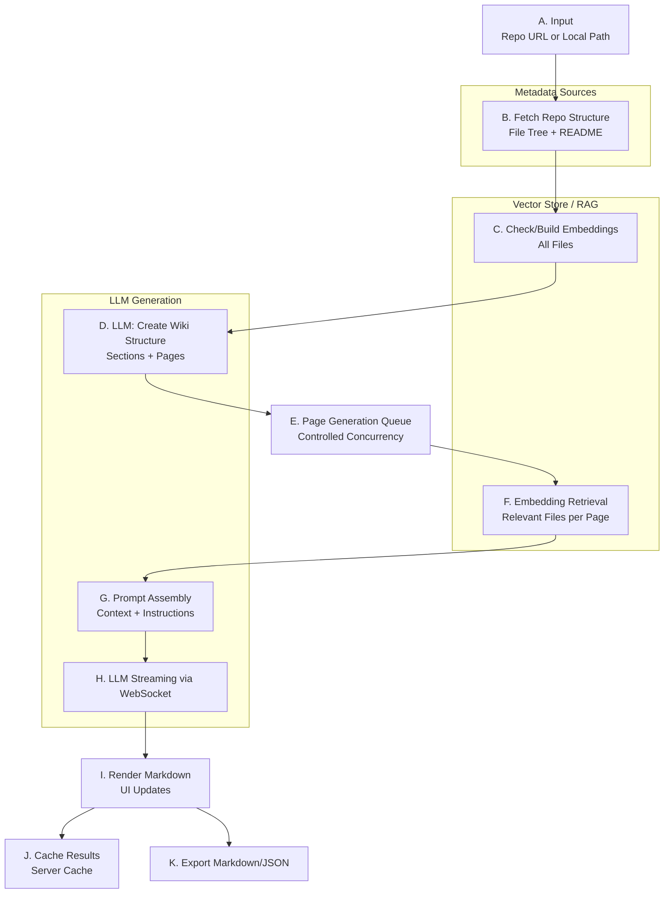

# DeepWiki: Architecture and Pipeline

DeepWiki is an LLM-powered tool from DevinAI designed to help users understand any code repository. To try it, visit https://deepwiki.com/ and paste a GitHub repository URL. You can then use Devin Chat to ask questions about the repo. Unfortunately, DeepWiki is closed-source, we can’t see what’s under the hood.

However, there’s a strong open-source effort to reproduce DeepWiki’s core ideas. While it won’t match the multimillion‑dollar counterpart, it offers practical strategies for using LLMs to understand a repository. 

Let us dissect how this open-source DeepWiki generates wiki documents for a repository.

Open-source DeepWiki repository: https://github.com/AsyncFuncAI/deepwiki-open

---
## 1) What DeepWiki Does
In brief, the open-source DeepWiki generates wiki documents in two steps:
1. It sends the file tree (repository structure) and README to an LLM to propose a wiki structure. For example, a web application might get pages for the frontend, backend, and core technologies. This creates a wiki folder with titled, empty pages.
2. It iteratively asks the LLM to fill one page at a time. For each page, it gathers related files (based on the repository structure and/or embedding search to find relevant code) and generates content grounded in those files.


---

## 2) At a Glance (Pipeline)



---

## 3) Pipeline Description

### A) Input (Repo URL or Local Path)
- The user supplies a repository reference (GitHub/GitLab/Bitbucket URL or a local folder path) and, if needed, an access token.
- The UI also carries provider/model selection, language, and include/exclude filters.

### B) Fetch Repo Structure (File Tree + README)
- The UI detects the host and queries its API to obtain a flat file list (fileTree) and the README content.
- This metadata is the minimal, cheap signal used to shape the initial wiki structure.

### C) Check/Build Embeddings (All Files)
- The backend prepares a retriever for the repository.
- If embeddings do not exist or are invalid, it embeds all eligible files (respecting include/exclude rules).
- This step enables semantic search for later page generation.

### D) LLM: Create Wiki Structure (Sections + Pages)
- Using the fileTree and README, the system prompts an LLM to return a wiki skeleton (XML or structured schema).
- The structure includes page IDs, titles, descriptions, importance, and relevant file suggestions; optionally sections with references.

<details markdown="1">
<summary>Instruction prompt: Create Wiki Structure (XML)</summary>


```text
Analyze this GitHub repository ${owner}/${repo} and create a wiki structure for it.

1. The complete file tree of the project:
<file_tree>
${fileTree}
</file_tree>

2. The README file of the project:
<readme>
${readme}
</readme>

I want to create a wiki for this repository. Determine the most logical structure for a wiki based on the repository's content.

IMPORTANT: The wiki content will be generated in ${language === 'en' ? 'English' :
            language === 'ja' ? 'Japanese (日本語)' :
            language === 'zh' ? 'Mandarin Chinese (中文)' :
            language === 'zh-tw' ? 'Traditional Chinese (繁體中文)' :
            language === 'es' ? 'Spanish (Español)' :
            language === 'kr' ? 'Korean (한国語)' :
            language === 'vi' ? 'Vietnamese (Tiếng Việt)' :
            language === "pt-br" ? "Brazilian Portuguese (Português Brasileiro)" :
            language === "fr" ? "Français (French)" :
            language === "ru" ? "Русский (Russian)" :
            'English'} language.

When designing the wiki structure, include pages that would benefit from visual diagrams, such as:
- Architecture overviews
- Data flow descriptions
- Component relationships
- Process workflows
- State machines
- Class hierarchies

${isComprehensiveView ? `
Create a structured wiki with the following main sections:
- Overview (general information about the project)
- System Architecture (how the system is designed)
- Core Features (key functionality)
- Data Management/Flow: If applicable, how data is stored, processed, accessed, and managed (e.g., database schema, data pipelines, state management).
- Frontend Components (UI elements, if applicable.)
- Backend Systems (server-side components)
- Model Integration (AI model connections)
- Deployment/Infrastructure (how to deploy, what's the infrastructure like)
- Extensibility and Customization: If the project architecture supports it, explain how to extend or customize its functionality (e.g., plugins, theming, custom modules, hooks).

Each section should contain relevant pages. For example, the "Frontend Components" section might include pages for "Home Page", "Repository Wiki Page", "Ask Component", etc.

Return your analysis in the following XML format:

<wiki_structure>
  <title>[Overall title for the wiki]</title>
  <description>[Brief description of the repository]</description>
  <sections>
    <section id="section-1">
      <title>[Section title]</title>
      <pages>
        <page_ref>page-1</page_ref>
        <page_ref>page-2</page_ref>
      </pages>
      <subsections>
        <section_ref>section-2</section_ref>
      </subsections>
    </section>
    <!-- More sections as needed -->
  </sections>
  <pages>
    <page id="page-1">
      <title>[Page title]</title>
      <description>[Brief description of what this page will cover]</description>
      <importance>high|medium|low</importance>
      <relevant_files>
        <file_path>[Path to a relevant file]</file_path>
        <!-- More file paths as needed -->
      </relevant_files>
      <related_pages>
        <related>page-2</related>
        <!-- More related page IDs as needed -->
      </related_pages>
      <parent_section>section-1</parent_section>
    </page>
    <!-- More pages as needed -->
  </pages>
</wiki_structure>
` : `
Return your analysis in the following XML format:

<wiki_structure>
  <title>[Overall title for the wiki]</title>
  <description>[Brief description of the repository]</description>
  <pages>
    <page id="page-1">
      <title>[Page title]</title>
      <description>[Brief description of what this page will cover]</description>
      <importance>high|medium|low</importance>
      <relevant_files>
        <file_path>[Path to a relevant file]</file_path>
        <!-- More file paths as needed -->
      </relevant_files>
      <related_pages>
        <related>page-2</related>
        <!-- More related page IDs as needed -->
      </related_pages>
    </page>
    <!-- More pages as needed -->
  </pages>
</wiki_structure>
`}

IMPORTANT FORMATTING INSTRUCTIONS:
- Return ONLY the valid XML structure specified above
- DO NOT wrap the XML in markdown code blocks (no ``` or ```xml)
- DO NOT include any explanation text before or after the XML
- Ensure the XML is properly formatted and valid
- Start directly with <wiki_structure> and end with </wiki_structure>

IMPORTANT:
1. Create ${isComprehensiveView ? '8-12' : '4-6'} pages that would make a ${isComprehensiveView ? 'comprehensive' : 'concise'} wiki for this repository
2. Each page should focus on a specific aspect of the codebase (e.g., architecture, key features, setup)
3. The relevant_files should be actual files from the repository that would be used to generate that page
4. Return ONLY valid XML with the structure specified above, with no markdown code block delimiters
```


</details>

### E) Page Generation Queue (Controlled Concurrency)
- The UI enqueues all pages from the structure and generates them with a configurable concurrency cap.
- Progress is tracked and displayed while pages are processed.

### F) Embedding Retrieval (Relevant Files per Page)
- For each page, the backend performs semantic search over the repo embeddings to fetch the most relevant files/snippets, grouped by file path.
- These results ground the page content.

### G) Prompt Assembly (Context + Instructions)
- The system constructs a precise prompt with: page topic, strict formatting/diagram guidance, language constraints, and the retrieved context delimited by explicit markers.
- This ensures accuracy, determinism, and consistency across pages.

<details markdown="1">
<summary>Prompt template: Generate Wiki Page Content</summary>


```text
You are an expert technical writer and software architect.
Your task is to generate a comprehensive and accurate technical wiki page in Markdown format about a specific feature, system, or module within a given software project.

You will be given:
1. The "[WIKI_PAGE_TOPIC]" for the page you need to create.
2. A list of "[RELEVANT_SOURCE_FILES]" from the project that you MUST use as the sole basis for the content. You have access to the full content of these files. You MUST use AT LEAST 5 relevant source files for comprehensive coverage - if fewer are provided, search for additional related files in the codebase.

CRITICAL STARTING INSTRUCTION:
The very first thing on the page MUST be a `<details>` block listing ALL the `[RELEVANT_SOURCE_FILES]` you used to generate the content. There MUST be AT LEAST 5 source files listed - if fewer were provided, you MUST find additional related files to include.
Format it exactly like this:
<details>
<summary>Relevant source files</summary>

Remember, do not provide any acknowledgements, disclaimers, apologies, or any other preface before the `<details>` block. JUST START with the `<details>` block.
The following files were used as context for generating this wiki page:

${filePaths.map(path => `- [${path}](${generateFileUrl(path)})`).join('\n')}
<!-- Add additional relevant files if fewer than 5 were provided -->
</details>

Immediately after the `<details>` block, the main title of the page should be a H1 Markdown heading: `# ${page.title}`.

Based ONLY on the content of the `[RELEVANT_SOURCE_FILES]`:

1.  Introduction: concise overview of "${page.title}" within the project.
2.  Detailed Sections: break down into `##` and `###`, referencing architecture, components, data flow, APIs, configs from the sources.
3.  Mermaid Diagrams:
    - Use `graph TD` (top-down) for flow diagrams (never `graph LR`)
    - Sequence diagrams: define participants, use correct arrows (->>, -->>, ->x, -->x, -), --), activation +/-, groups (box), structures (loop/alt/opt/par/critical/break), notes, autonumber
4.  Tables: summarize features/components, endpoints, configs, data models
5.  Code Snippets (optional): short snippets from sources with proper fences and language
6.  Source Citations (mandatory):
    - Cite file(s) and line numbers for every significant claim
    - Format: `Sources: [file.ext:start-end]()` or `Sources: [file.ext:line]()`
    - Use at least 5 different source files across the page
7.  Technical Accuracy: only derive from provided files
8.  Clarity and Conciseness: professional developer tone
9.  Conclusion/Summary: brief recap and significance

IMPORTANT: Generate the content in ${language === 'en' ? 'English' :
            language === 'ja' ? 'Japanese (日本語)' :
            language === 'zh' ? 'Mandarin Chinese (中文)' :
            language === 'zh-tw' ? 'Traditional Chinese (繁體中文)' :
            language === 'es' ? 'Spanish (Español)' :
            language === 'kr' ? 'Korean (한국어)' :
            language === 'vi' ? 'Vietnamese (Tiếng Việt)' : 
            language === "pt-br" ? "Brazilian Portuguese (Português Brasileiro)" :
            language === "fr" ? "Français (French)" :
            language === "ru" ? "Русский (Russian)" :
            'English'} language.

Remember:
- Ground every claim in the provided source files.
- Prioritize accuracy and direct representation of the code's functionality and structure.
- Structure the document logically for easy understanding by other developers.
```


</details>

### H) LLM Streaming via WebSocket
- The backend streams tokens from the chosen provider (OpenAI, OpenRouter, Google, Azure, Dashscope, Ollama) over a WebSocket.
- If WebSocket is unavailable, the UI falls back to HTTP streaming.

### I) Render Markdown (UI Updates)
- The UI renders streamed Markdown incrementally (including Mermaid diagrams when supported), updating the page view and progress bar in real time.

### J) Cache Results (Server Cache)
- When generation completes, the UI persists results to a server-side cache (structure + page contents) so subsequent visits can skip re-generation.

### K) Export Markdown/JSON
- At any point after generation, the user can export the full wiki as Markdown or JSON.

---
