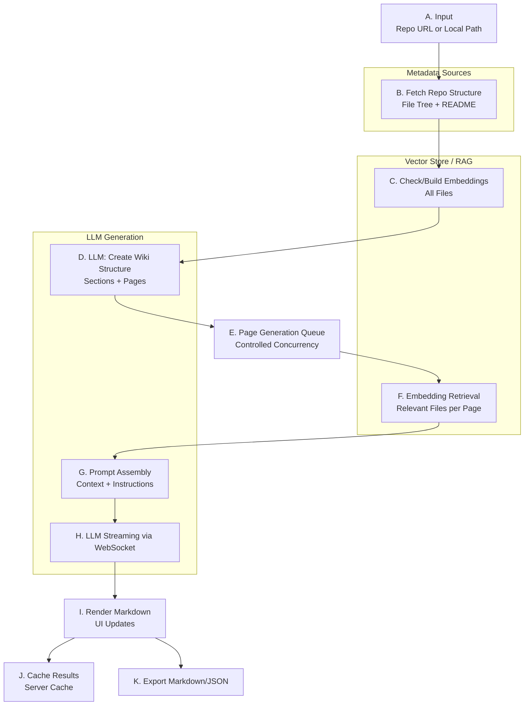

# DeepWiki: Architecture and Pipeline

A concise overview of the open-source DeepWiki system that generates structured, high-quality wiki documentation for any code repository.

Repository: https://github.com/AsyncFuncAI/deepwiki-open

---

## 1) What DeepWiki Does

DeepWiki generates high-quality, structured wiki documentation for a code repository by:
- Maintaining embeddings for all source files in the repo for semantic retrieval
- Using repository metadata (file tree + README) to synthesize a wiki structure with an LLM
- Generating each wiki page by retrieving the most relevant files (via embeddings) and streaming LLM content into the UI
- Caching results and supporting export in Markdown/JSON

Key outcomes:
- Consistent, navigable wiki (sections, pages, summaries)
- Grounded content via semantic retrieval across the codebase
- Fast iteration via streaming UX and server-side caching
- Portable exports in Markdown or JSON

---

## 2) At a Glance (Pipeline)

---

## 3) Pipeline Description

### A) Input (Repo URL or Local Path)
- The user supplies a repository reference (GitHub/GitLab/Bitbucket URL or a local folder path) and, if needed, an access token.
- The UI also carries provider/model selection, language, and include/exclude filters.

### B) Fetch Repo Structure (File Tree + README)
- The UI detects the host and queries its API to obtain a flat file list (fileTree) and the README content.
- This metadata is the minimal, cheap signal used to shape the initial wiki structure.

### C) Check/Build Embeddings (All Files)
- The backend prepares a retriever for the repository.
- If embeddings do not exist or are invalid, it embeds all eligible files (respecting include/exclude rules).
- This step enables semantic search for later page generation.

### D) LLM: Create Wiki Structure (Sections + Pages)
- Using the fileTree and README, the system prompts an LLM to return a wiki skeleton (XML or structured schema).
- The structure includes page IDs, titles, descriptions, importance, and relevant file suggestions; optionally sections with references.

### E) Page Generation Queue (Controlled Concurrency)
- The UI enqueues all pages from the structure and generates them with a configurable concurrency cap.
- Progress is tracked and displayed while pages are processed.

### F) Embedding Retrieval (Relevant Files per Page)
- For each page, the backend performs semantic search over the repo embeddings to fetch the most relevant files/snippets, grouped by file path.
- These results ground the page content.

### G) Prompt Assembly (Context + Instructions)
- The system constructs a precise prompt with: page topic, strict formatting/diagram guidance, language constraints, and the retrieved context delimited by explicit markers.
- This ensures accuracy, determinism, and consistency across pages.

### H) LLM Streaming via WebSocket
- The backend streams tokens from the chosen provider (OpenAI, OpenRouter, Google, Azure, Dashscope, Ollama) over a WebSocket.
- If WebSocket is unavailable, the UI falls back to HTTP streaming.

### I) Render Markdown (UI Updates)
- The UI renders streamed Markdown incrementally (including Mermaid diagrams when supported), updating the page view and progress bar in real time.

### J) Cache Results (Server Cache)
- When generation completes, the UI persists results to a server-side cache (structure + page contents) so subsequent visits can skip re-generation.

### K) Export Markdown/JSON
- At any point after generation, the user can export the full wiki as Markdown or JSON.

---

## 4) Conceptual Architecture (High Level)

- Metadata layer:
  - Lightweight repo scan: file tree + README
  - Cheap signal to design structure before doing heavy LLM work

- Vector store / RAG:
  - Embeddings for all eligible files (respect filters)
  - Semantic retrieval per-page for relevant file content

- Orchestration:
  - Page queue with concurrency limits
  - Deterministic prompt construction (topic, constraints, retrieved context)
  - Streaming generation with provider abstraction

- Persistence and UX:
  - Server cache for structure and generated pages
  - Incremental rendering and progress feedback
  - Export to portable formats (Markdown/JSON)

---

## 5) Practical Notes and Tips

- Include/exclude is important to avoid embedding large vendor or build artifacts.
- Rebuilding embeddings happens only when needed to reduce cost.
- Provider/model choice affects latency and style; keep prompts strict and stable.
- Use exports to version generated docs alongside source code.
- For multi-language repos, ensure language is specified in prompts and UI.
