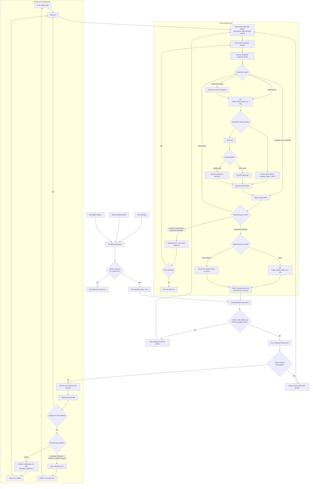

<article class="agent-loop-document" markdown="1">

<p class="document-label">TECHNICAL NOTE</p>

# How the Codex Agent Loop Works

<p class="document-summary">Codex is controlled by two related loops: an inner loop that may sample the model several times during one turn, and an optional outer Goal loop that can start another turn after the thread becomes idle.</p>

<dl class="document-meta">
  <div><dt>Scope</dt><dd>Codex core turn orchestration and Goal continuation</dd></div>
  <div><dt>Source snapshot</dt><dd>Local <code>codex-main</code> checkout, checked 9 September 2026</dd></div>
  <div><dt>Key distinction</dt><dd>A sampling response is not the same thing as a completed turn</dd></div>
</dl>

## Executive summary

A user request starts a **turn**. During that turn, Codex builds model input from the conversation, instructions, available tools, and current context. It sends a model inference request and consumes the streamed response.

If the model emits a tool call, Codex executes it through the generic `ToolRouter`, records the result in conversation history, and samples the model again. New user steering, client-injected context, or an inter-agent mailbox item can also keep the turn running.

The turn can finish only when:

1. the sampling stream has reached `response.completed`;
2. `model_needs_follow_up` is false;
3. `has_pending_input` is false; and
4. configured Stop hooks do not request continuation.

After the turn finishes, a separate optional Goal lifecycle may start another turn. It does so only when a persisted Goal exists with status `Active`.

## Complete control flow

<div class="diagram-note">Read from top to bottom. Dashed or branching behavior is represented by labeled edges rather than animation.</div>



## 1. Turns and sampling cycles

These terms describe different boundaries:

| Term | Meaning |
|---|---|
| **Thread** | The durable conversation and its accumulated history. |
| **Turn** | Work initiated by user input or internal continuation input. One turn may contain several sampling cycles. |
| **Sampling cycle** | One model inference request and its streamed response events, ending successfully at `response.completed`. |
| **Tool call** | A model output item that Codex routes to a registered tool implementation. |

`RegularTask::run` invokes `run_turn`. Inside `run_turn`, Codex repeatedly constructs model input and calls the sampling runtime until the continuation gate becomes false or an error ends the turn.

The model input is reconstructed from recorded conversation history for every sampling cycle. This is why a tool result can influence the model's next response without starting a new user turn.

## 2. What a sampling response contains

The Responses stream may deliver assistant messages, reasoning items, tool calls, usage information, and other events. Codex processes completed output items as they arrive.

A successful sampling cycle requires the terminal `response.completed` event. If the stream closes before that event, Codex treats the stream as an error rather than as a final answer.

`response.completed` may include an optional `end_turn` value:

- `end_turn: false` explicitly sets `model_needs_follow_up = true`;
- `end_turn: true` does not force the turn to end; and
- an absent `end_turn` also does not independently decide completion.

The accumulated runtime state still controls whether Codex samples again.

## 3. Tool execution and feedback

`ToolRouter` is generic. It does not lead only to Goal operations. It can route shell commands, file patches, MCP calls, browser or application tools, agent operations, Goal tools, and any other tool registered for the current model request.

When `handle_output_item_done` recognizes a valid tool call, it:

1. records the tool-call item;
2. schedules the tool runtime;
3. sets `needs_follow_up = true`; and
4. later appends the tool result to conversation history.

If a tool request should be rejected or corrected, Codex records feedback for the model and still sets `needs_follow_up = true`. The model therefore gets a chance to recover in a later sampling cycle.

## 4. The deterministic continuation gate

After sampling and queued tool work finish, `run_turn` calculates:

```text
needs_follow_up = model_needs_follow_up || has_pending_input
```

`model_needs_follow_up` becomes true when the sampling cycle requires more model work, including:

- a recognized tool call;
- correction feedback for an invalid or rejected tool request; or
- `end_turn: false` on `response.completed`.

`has_pending_input` becomes true only when delivery is allowed for the current turn and Codex finds either:

- an item in the turn's pending-input queue; or
- an accepted item in the inter-agent mailbox.

User steering and client-injected context enter through the pending-input flow. Input that cannot be delivered to the current turn remains available for a later turn.

## 5. Stop hooks and final responses

If the continuation gate is false, Codex runs the configured Stop hooks. A Stop hook may return continuation content. Codex records that content as a prompt and resumes the sampling loop.

Otherwise, the turn ends.

There is no deterministic text pattern such as “this is my final answer.” The model does not need to label an assistant message as final. Finality follows from runtime state:

```text
response.completed received
AND model_needs_follow_up == false
AND has_pending_input == false
AND Stop hooks allow completion
```

An assistant message without a tool call can therefore be the final response, but only if the other conditions also hold.

## 6. The optional Goal lifecycle

Goal persistence is separate from the inner turn loop. Codex does not always use the Goal tool, and a normal task does not need a Goal.

The Goal extension acts when the thread is idle:

1. it loads the persisted Goal;
2. it returns without continuing if no Goal exists;
3. it returns unless the status is `Active`;
4. it renders `continuation.md` using the persisted `Goal.objective`; and
5. it submits the resulting internal context with `start_turn_if_idle()`.

The template places the objective in a hidden user-role context fragment:

```xml
<objective>
Goal.objective
</objective>
```

The objective is one field of the Goal, not the whole Goal. Persisted Goal state also includes status and accounting information such as optional budgets.

## 7. How Goal completion is checked

The current `continuation.md` asks the model to perform an evidence-based completion audit. It tells the model to derive requirements from the objective, inspect authoritative current state, and treat missing or indirect evidence as incomplete.

When the model concludes that every requirement is satisfied, it calls `update_goal` with status `complete`. If the strict repeated-blocker conditions are satisfied, it may use status `blocked`.

This is a **model-led semantic judgment guided by explicit instructions and evidence**. The Goal runtime validates and persists the requested state transition; it is not a separate general-purpose verifier that can independently prove an arbitrary objective complete.

## 8. Error and retry boundaries

Not every failed sampling request immediately ends the turn. Retry policy may repeat the inference request for recoverable failures. Other conditions can trigger context compaction before another sampling cycle. Cancellation, unrecoverable stream errors, invalid image requests, or exhausted retry policy can end the turn with an error.

These paths are operational details around the same core invariant: Codex only treats a sampling response as successfully completed after receiving `response.completed`.

## Source map

The explanation above is grounded in these implementation files:

- [`core/src/session/turn.rs`](https://github.com/openai/codex/blob/main/codex-rs/core/src/session/turn.rs) — sampling loop, combined continuation gate, Stop hooks, stream completion, and tool-result draining.
- [`core/src/tasks/regular.rs`](https://github.com/openai/codex/blob/main/codex-rs/core/src/tasks/regular.rs) — regular turn execution and pending-input handling around `run_turn`.
- [`core/src/stream_events_utils.rs`](https://github.com/openai/codex/blob/main/codex-rs/core/src/stream_events_utils.rs) — completed output-item handling, tool scheduling, and follow-up state.
- [`core/src/session/input_queue.rs`](https://github.com/openai/codex/blob/main/codex-rs/core/src/session/input_queue.rs) — pending turn input and mailbox-delivery checks.
- [`core/src/tools/router.rs`](https://github.com/openai/codex/blob/main/codex-rs/core/src/tools/router.rs) — generic tool-call parsing and dispatch.
- [`ext/goal/src/runtime.rs`](https://github.com/openai/codex/blob/main/codex-rs/ext/goal/src/runtime.rs) — Active Goal lookup and `start_turn_if_idle()`.
- [`ext/goal/src/steering.rs`](https://github.com/openai/codex/blob/main/codex-rs/ext/goal/src/steering.rs) — conversion of Goal templates into internal user context.
- [`ext/goal/templates/goals/continuation.md`](https://github.com/openai/codex/blob/main/codex-rs/ext/goal/templates/goals/continuation.md) — persisted objective, budget, progress, completion-audit, and blocked-audit instructions.

</article>

<style>
  .agent-loop-document {
    max-width: 780px;
    margin: 0 auto;
    color: #202124;
    font-family: Georgia, "Times New Roman", serif;
    font-size: 1.02rem;
  }

  .agent-loop-document h1,
  .agent-loop-document h2,
  .agent-loop-document h3,
  .agent-loop-document table,
  .agent-loop-document pre,
  .agent-loop-document .document-label,
  .agent-loop-document .document-meta,
  .agent-loop-document .diagram-note {
    font-family: -apple-system, BlinkMacSystemFont, "Segoe UI", Roboto, Arial, sans-serif;
  }

  .agent-loop-document h1 {
    margin: .2rem 0 1rem;
    font-size: clamp(2rem, 5vw, 3.25rem);
    letter-spacing: -.035em;
  }

  .agent-loop-document h2 {
    margin-top: 3rem;
    padding-bottom: .45rem;
    border-bottom: 1px solid #d7d7d7;
    font-size: 1.55rem;
    letter-spacing: -.015em;
  }

  .agent-loop-document h3 { font-size: 1.15rem; }

  .agent-loop-document p,
  .agent-loop-document li { max-width: 72ch; }

  .document-label {
    margin: 0;
    color: #686868;
    font-size: .76rem;
    font-weight: 700;
    letter-spacing: .14em;
  }

  .document-summary {
    margin-bottom: 1.5rem;
    color: #4f4f4f;
    font-size: 1.16rem;
    line-height: 1.65;
  }

  .document-meta {
    margin: 0 0 2.5rem;
    padding: 1rem 0;
    border-top: 1px solid #cfcfcf;
    border-bottom: 1px solid #cfcfcf;
    font-size: .82rem;
  }

  .document-meta div {
    display: grid;
    grid-template-columns: 130px minmax(0, 1fr);
    gap: 1rem;
    padding: .2rem 0;
  }

  .document-meta dt { color: #666; font-weight: 700; }
  .document-meta dd { margin: 0; }

  .diagram-note {
    margin-bottom: .75rem;
    color: #666;
    font-size: .8rem;
  }

  .agent-loop-document .mermaid-document {
    margin: 1rem 0 2rem;
    padding: 1rem;
    overflow-x: auto;
    border: 1px solid #d7d7d7;
    background: #fff;
  }

  .agent-loop-document .mermaid-document svg {
    display: block;
    min-width: 760px;
    height: auto;
    margin: 0 auto;
  }

  .agent-loop-document table {
    width: 100%;
    margin: 1.25rem 0 2rem;
    border-collapse: collapse;
    font-size: .88rem;
  }

  .agent-loop-document th,
  .agent-loop-document td {
    padding: .65rem .75rem;
    border: 1px solid #d7d7d7;
    text-align: left;
    vertical-align: top;
  }

  .agent-loop-document th { background: #f2f2f2; }

  .agent-loop-document pre {
    border: 1px solid #d7d7d7;
    background: #f6f6f6;
    color: #202124;
  }

  .agent-loop-document code { font-size: .9em; }

  @media (max-width: 620px) {
    .document-meta div { grid-template-columns: 1fr; gap: 0; padding: .4rem 0; }
    .agent-loop-document { font-size: 1rem; }
  }

  @media print {
    .agent-loop-document { max-width: none; color: #000; }
    .agent-loop-document .mermaid-document { overflow: visible; border: 0; padding: 0; }
    .agent-loop-document .mermaid-document svg { min-width: 0; max-width: 100%; }
  }
</style>

<script type="module">
  import mermaid from "https://cdn.jsdelivr.net/npm/mermaid@10/dist/mermaid.esm.min.mjs";

  mermaid.initialize({
    startOnLoad: false,
    theme: "base",
    flowchart: { htmlLabels: true, curve: "basis", useMaxWidth: false },
    themeVariables: {
      fontFamily: "-apple-system, BlinkMacSystemFont, Segoe UI, Roboto, Arial, sans-serif",
      primaryColor: "#ffffff",
      primaryTextColor: "#202124",
      primaryBorderColor: "#202124",
      lineColor: "#555555",
      secondaryColor: "#f2f2f2",
      tertiaryColor: "#fafafa",
      clusterBkg: "#fafafa",
      clusterBorder: "#9a9a9a",
      edgeLabelBackground: "#ffffff"
    }
  });

  const blocks = document.querySelectorAll('pre code.language-mermaid');
  blocks.forEach((code) => {
    const container = document.createElement('div');
    container.className = 'mermaid mermaid-document';
    container.textContent = code.textContent;
    code.parentElement.replaceWith(container);
  });
  await mermaid.run({ querySelector: '.mermaid-document' });
</script>
